# Modelo de Datos — LUNORION LABS

Diagrama de entidades, relaciones y campos obligatorios, incluyendo campos legales (SUNAT, PLAME, PLE, auditoría).

---

## Diagrama DER (PlantUML)

Renderizar en https://www.plantuml.com/plantuml/uml/

```plantuml
@startuml LUNORION_LABS_DER

skinparam packageStyle rectangle
skinparam class {
  BackgroundColor #FEFEFE
  BorderColor #333333
}

' ============================================
' MULTITENANT & SEGURIDAD
' ============================================
class tenant {
  + id: UUID <<PK>>
  + ruc: VARCHAR(11) <<UNIQUE>>
  + razon_social: VARCHAR(200)
  + nombre_comercial: VARCHAR(200)
  + domicilio_fiscal: VARCHAR(300)
  + email: VARCHAR(100)
  + telefono: VARCHAR(20)
  + regimen_tributario: VARCHAR(30)
  + plan: VARCHAR(30)
  + estado: VARCHAR(20)
  + certificado_p12: BYTEA
  + certificado_password: TEXT
  + certificado_validez: DATE
  + ruc_validado_sunat: BOOLEAN
  + created_at: TIMESTAMP
  + updated_at: TIMESTAMP
}

class usuario {
  + id: UUID <<PK>>
  + tenant_id: UUID <<FK>>
  + email: VARCHAR(100) <<UNIQUE>>
  + password_hash: TEXT
  + nombres: VARCHAR(100)
  + apellidos: VARCHAR(100)
  + dni: VARCHAR(8)
  + telefono: VARCHAR(20)
  + rol: VARCHAR(12) // SUPER_ADMIN, ADMIN o PUBLIC
  + activo: BOOLEAN
  + ultimo_acceso: TIMESTAMP
  + created_at: TIMESTAMP
}

class permiso {
  + id: UUID <<PK>>
  + codigo: VARCHAR(50) <<UNIQUE>>
  + nombre: VARCHAR(100)
  + modulo: VARCHAR(50)
}

class usuario_permiso {
  + id: UUID <<PK>>
  + usuario_id: UUID <<FK>>
  + permiso_id: UUID <<FK>>
  + created_at: TIMESTAMP
}

' ============================================
' CATÁLOGO DE PRODUCTOS
' ============================================
class categoria_producto {
  + id: UUID <<PK>>
  + tenant_id: UUID <<FK>>
  + nombre: VARCHAR(100)
  + categoria_padre_id: UUID <<FK>>
  + created_at: TIMESTAMP
}

class producto {
  + id: UUID <<PK>>
  + tenant_id: UUID <<FK>>
  + categoria_id: UUID <<FK>>
  + codigo: VARCHAR(50) <<UNIQUE>>
  + codigo_barra: VARCHAR(50)
  + nombre: VARCHAR(200)
  + descripcion: TEXT
  + marca: VARCHAR(100)
  + modelo: VARCHAR(100)
  + unidad_medida: VARCHAR(20)
  + precio_compra: DECIMAL(10,2)
  + precio_venta: DECIMAL(10,2)
  + stock_actual: DECIMAL(10,2)
  + stock_minimo: DECIMAL(10,2)
  + ubicacion: VARCHAR(100)
  + tipo: VARCHAR(20) // PRODUCTO, SERVICIO, INSUMO
  + activo: BOOLEAN
  + created_at: TIMESTAMP
  + updated_at: TIMESTAMP
}

' ============================================
' INVENTARIO
' ============================================
class movimiento_stock {
  + id: UUID <<PK>>
  + tenant_id: UUID <<FK>>
  + producto_id: UUID <<FK>>
  + tipo: VARCHAR(20) // INGRESO, EGRESO, AJUSTE
  + subtipo: VARCHAR(30) // COMPRA, VENTA, CONSUMO_OT, DEVOLUCION, MERMA
  + cantidad: DECIMAL(10,2)
  + costo_unitario: DECIMAL(10,2)
  + stock_anterior: DECIMAL(10,2)
  + stock_posterior: DECIMAL(10,2)
  + documento_origen: VARCHAR(50) // id de OT, venta, compra
  + tipo_documento_origen: VARCHAR(30) // OT, SALE, PURCHASE
  + observacion: TEXT
  + usuario_id: UUID <<FK>>
  + created_at: TIMESTAMP
}

class proveedor {
  + id: UUID <<PK>>
  + tenant_id: UUID <<FK>>
  + ruc: VARCHAR(11)
  + razon_social: VARCHAR(200)
  + contacto: VARCHAR(100)
  + telefono: VARCHAR(20)
  + email: VARCHAR(100)
  + direccion: VARCHAR(300)
  + condiciones_pago: VARCHAR(100)
  + activo: BOOLEAN
  + created_at: TIMESTAMP
}

class orden_compra {
  + id: UUID <<PK>>
  + tenant_id: UUID <<FK>>
  + proveedor_id: UUID <<FK>>
  + numero_orden: VARCHAR(20) <<UNIQUE>>
  + fecha_emision: DATE
  + estado: VARCHAR(20) // PENDIENTE, PARCIAL, COMPLETADA, ANULADA
  + total: DECIMAL(10,2)
  + observacion: TEXT
  + usuario_id: UUID <<FK>>
  + created_at: TIMESTAMP
}

class orden_compra_item {
  + id: UUID <<PK>>
  + orden_compra_id: UUID <<FK>>
  + producto_id: UUID <<FK>>
  + cantidad: DECIMAL(10,2)
  + cantidad_recibida: DECIMAL(10,2)
  + precio_unitario: DECIMAL(10,2)
  + subtotal: DECIMAL(10,2)
}

' ============================================
' CLIENTES & VEHÍCULOS
' ============================================
class cliente {
  + id: UUID <<PK>>
  + tenant_id: UUID <<FK>>
  + tipo_documento: VARCHAR(3) // DNI, RUC, CE
  + numero_documento: VARCHAR(15) <<UNIQUE>>
  + nombres: VARCHAR(100)
  + apellidos: VARCHAR(100)
  + razon_social: VARCHAR(200)
  + direccion: VARCHAR(300)
  + telefono: VARCHAR(20)
  + email: VARCHAR(100)
  + consentimiento_datos: BOOLEAN
  + fecha_consentimiento: DATE
  + activo: BOOLEAN
  + created_at: TIMESTAMP
  + updated_at: TIMESTAMP
}

class vehiculo {
  + id: UUID <<PK>>
  + tenant_id: UUID <<FK>>
  + cliente_id: UUID <<FK>>
  + placa: VARCHAR(10) <<UNIQUE>>
  + numero_chasis: VARCHAR(30)
  + numero_motor: VARCHAR(30)
  + marca: VARCHAR(50)
  + modelo: VARCHAR(50)
  + año: INTEGER
  + color: VARCHAR(30)
  + kilometraje: INTEGER
  + tipo_combustible: VARCHAR(20)
  + created_at: TIMESTAMP
  + updated_at: TIMESTAMP
}

' ============================================
' VENTAS Y COMPROBANTES ELECTRÓNICOS
' ============================================
class venta {
  + id: UUID <<PK>>
  + tenant_id: UUID <<FK>>
  + cliente_id: UUID <<FK>>
  + tipo: VARCHAR(20) // MOSTRADOR, OT
  + subtotal: DECIMAL(10,2)
  + igv: DECIMAL(10,2)
  + total: DECIMAL(10,2)
  + descuento: DECIMAL(10,2)
  + metodo_pago: VARCHAR(30)
  + estado_pago: VARCHAR(20) // PENDIENTE, PAGADO, PARCIAL
  + usuario_id: UUID <<FK>>
  + created_at: TIMESTAMP
}

class venta_item {
  + id: UUID <<PK>>
  + venta_id: UUID <<FK>>
  + producto_id: UUID <<FK>>
  + cantidad: DECIMAL(10,2)
  + precio_unitario: DECIMAL(10,2)
  + descuento: DECIMAL(10,2)
  + subtotal: DECIMAL(10,2)
}

class comprobante_electronico {
  + id: UUID <<PK>>
  + tenant_id: UUID <<FK>>
  + venta_id: UUID <<FK>>
  + tipo: VARCHAR(2) // 01=Factura, 03=Boleta, 07=NC, 08=ND
  + serie: VARCHAR(4)
  + numero: INTEGER
  + fecha_emision: DATE
  + hora_emision: TIME
  + xml_firmado: TEXT
  + xml_cdr: TEXT
  + hash_firma: VARCHAR(64)
  + estado_sunat: VARCHAR(20) // CREADO, FIRMADO, ENVIADO, ACEPTADO, RECHAZADO, OBSERVADO
  + codigo_error_sunat: VARCHAR(10)
  + descripcion_error: TEXT
  + comprobante_referencia_id: UUID <<FK>> // Para NC/ND
  + monto_operaciones_gravadas: DECIMAL(10,2)
  + monto_igv: DECIMAL(10,2)
  + monto_total: DECIMAL(10,2)
  + ruc_cliente: VARCHAR(11)
  + razon_social_cliente: VARCHAR(200)
  + intentos_envio: INTEGER
  + ultimo_envio: TIMESTAMP
  + enviado_por: UUID <<FK>>
  + created_at: TIMESTAMP
}

class resumen_diario {
  + id: UUID <<PK>>
  + tenant_id: UUID <<FK>>
  + fecha_resumen: DATE
  + codigo_resumen: VARCHAR(20) <<UNIQUE>>
  + xml_firmado: TEXT
  + xml_cdr: TEXT
  + estado: VARCHAR(20)
  + total_boletas: INTEGER
  + total_anulaciones: INTEGER
  + created_at: TIMESTAMP
}

class resumen_diario_item {
  + id: UUID <<PK>>
  + resumen_id: UUID <<FK>>
  + comprobante_id: UUID <<FK>>
  + tipo_operacion: VARCHAR(10) // AGREGAR, ANULAR, MODIFICAR
}

' ============================================
' ÓRDENES DE TRABAJO
' ============================================
class orden_trabajo {
  + id: UUID <<PK>>
  + tenant_id: UUID <<FK>>
  + cliente_id: UUID <<FK>>
  + vehiculo_id: UUID <<FK>>
  + tecnico_id: UUID <<FK>>
  + numero_ot: VARCHAR(20) <<UNIQUE>>
  + estado: VARCHAR(20) // PENDIENTE, EN_PROGRESO, EN_REVISION, CERRADO, REABIERTO
  + motivo_ingreso: TEXT
  + kilometraje_ingreso: INTEGER
  + fecha_ingreso: TIMESTAMP
  + fecha_prometida: DATE
  + fecha_cierre: TIMESTAMP
  + total_repuestos: DECIMAL(10,2)
  + total_mano_obra: DECIMAL(10,2)
  + total: DECIMAL(10,2)
  + ot_origen_id: UUID <<FK>> // Para garantía
  + motivo_garantia: TEXT
  + usuario_creo: UUID <<FK>>
  + usuario_cerro: UUID <<FK>>
  + created_at: TIMESTAMP
  + updated_at: TIMESTAMP
}

class ot_insumo {
  + id: UUID <<PK>>
  + ot_id: UUID <<FK>>
  + producto_id: UUID <<FK>>
  + cantidad: DECIMAL(10,2)
  + precio_unitario: DECIMAL(10,2)
  + subtotal: DECIMAL(10,2)
  + created_at: TIMESTAMP
}

class ot_mano_obra {
  + id: UUID <<PK>>
  + ot_id: UUID <<FK>>
  + tecnico_id: UUID <<FK>>
  + servicio_descripcion: VARCHAR(200)
  + horas: DECIMAL(5,2)
  + tarifa_hora: DECIMAL(10,2)
  + subtotal: DECIMAL(10,2)
  + created_at: TIMESTAMP
}

' ============================================
' CHECK-IN DIGITAL
' ============================================
class checkin {
  + id: UUID <<PK>>
  + tenant_id: UUID <<FK>>
  + cliente_id: UUID <<FK>>
  + vehiculo_id: UUID <<FK>>
  + kilometraje: INTEGER
  + nivel_combustible: VARCHAR(10)
  + observaciones_cliente: TEXT
  + firma_cliente: TEXT // base64
  + pdf_acta: TEXT
  + ot_id: UUID <<FK>>
  + usuario_id: UUID <<FK>>
  + created_at: TIMESTAMP
}

class checkin_foto {
  + id: UUID <<PK>>
  + checkin_id: UUID <<FK>>
  + tipo: VARCHAR(20) // TABLERO, EXTERIOR, INTERIOR, DAÑO
  + angulo: VARCHAR(20) // FRONTAL, TRASERO, LATERAL_DER, LATERAL_IZQ
  + url: TEXT
  + created_at: TIMESTAMP
}

' ============================================
' CITAS
' ============================================
class cita {
  + id: UUID <<PK>>
  + tenant_id: UUID <<FK>>
  + cliente_id: UUID <<FK>>
  + vehiculo_id: UUID <<FK>>
  + tecnico_id: UUID <<FK>>
  + servicio_descripcion: TEXT
  + fecha_hora: TIMESTAMP
  + duracion_minutos: INTEGER
  + estado: VARCHAR(20) // PROGRAMADA, CONFIRMADA, EN_ATENCION, COMPLETADA, CANCELADA
  + recordatorio_enviado: BOOLEAN
  + notificar_whatsapp: BOOLEAN
  + usuario_creo: UUID <<FK>>
  + created_at: TIMESTAMP
}

' ============================================
' CAJA
' ============================================
class cierre_caja {
  + id: UUID <<PK>>
  + tenant_id: UUID <<FK>>
  + fecha: DATE
  + hora_apertura: TIME
  + hora_cierre: TIME
  + saldo_inicial: DECIMAL(10,2)
  + total_ingresos: DECIMAL(10,2)
  + total_egresos: DECIMAL(10,2)
  + saldo_esperado: DECIMAL(10,2)
  + saldo_real: DECIMAL(10,2)
  + descuadre: DECIMAL(10,2)
  + observacion: TEXT
  + usuario_apertura: UUID <<FK>>
  + usuario_cierre: UUID <<FK>>
  + created_at: TIMESTAMP
}

class movimiento_caja {
  + id: UUID <<PK>>
  + tenant_id: UUID <<FK>>
  + cierre_caja_id: UUID <<FK>>
  + tipo: VARCHAR(20) // INGRESO, EGRESO
  + metodo_pago: VARCHAR(30) // EFECTIVO, TARJETA, YAPE, TRANSFERENCIA
  + monto: DECIMAL(10,2)
  + referencia: VARCHAR(100) // venta_id, comprobante_id
  + concepto: VARCHAR(200)
  + usuario_id: UUID <<FK>>
  + created_at: TIMESTAMP
}

' ============================================
' RRHH
' ============================================
class tecnico {
  + id: UUID <<PK>>
  + tenant_id: UUID <<FK>>
  + usuario_id: UUID <<FK>>
  + especialidades: TEXT // JSON array
  + tarifa_hora: DECIMAL(10,2)
  + numero_contacto: VARCHAR(20)
  + fecha_ingreso: DATE
  + activo: BOOLEAN
  + created_at: TIMESTAMP
}

class asistencia {
  + id: UUID <<PK>>
  + tenant_id: UUID <<FK>>
  + tecnico_id: UUID <<FK>>
  + fecha: DATE
  + hora_entrada: TIME
  + hora_salida: TIME
  + horas_trabajadas: DECIMAL(5,2)
  + tipo: VARCHAR(20) // NORMAL, TARDE, FALTA, VACACIONES, DESCANSO
  + created_at: TIMESTAMP
}

class boleta_pago {
  + id: UUID <<PK>>
  + tenant_id: UUID <<FK>>
  + tecnico_id: UUID <<FK>>
  + periodo: VARCHAR(6) // YYYYMM
  + sueldo_basico: DECIMAL(10,2)
  + horas_extras: DECIMAL(10,2)
  + comisiones: DECIMAL(10,2)
  + asignacion_familiar: DECIMAL(10,2)
  + total_ingresos: DECIMAL(10,2)
  + descuento_onp: DECIMAL(10,2)
  + descuento_afp: DECIMAL(10,2)
  + descuento_otros: DECIMAL(10,2)
  + total_descuentos: DECIMAL(10,2)
  + neto_pagar: DECIMAL(10,2)
  + essalud: DECIMAL(10,2)
  + pdf_generado: TEXT
  + pdf_firmado: BOOLEAN
  + created_at: TIMESTAMP
}

class configuracion_comision {
  + id: UUID <<PK>>
  + tenant_id: UUID <<FK>>
  + tecnico_id: UUID <<FK>>
  + producto_id: UUID <<FK>> // null = aplica a todos
  + tipo: VARCHAR(20) // SERVICIO, PRODUCTO, AMBOS
  + porcentaje: DECIMAL(5,2)
  + activo: BOOLEAN
  + created_at: TIMESTAMP
}

' ============================================
' PLE & AUDITORÍA
' ============================================
class ple_generado {
  + id: UUID <<PK>>
  + tenant_id: UUID <<FK>>
  + tipo_libro: VARCHAR(20) // RVE, COMPRAS, DIARIO, MAYOR
  + codigo_sunat: VARCHAR(10)
  + periodo: VARCHAR(6) // YYYYMM
  + archivo_txt: TEXT
  + hash_archivo: VARCHAR(64)
  + estado: VARCHAR(20)
  + usuario_genero: UUID <<FK>>
  + created_at: TIMESTAMP
}

class auditoria {
  + id: UUID <<PK>>
  + tenant_id: UUID <<FK>>
  + evento: VARCHAR(50)
  + entidad: VARCHAR(50)
  + entidad_id: VARCHAR(50)
  + usuario_id: UUID <<FK>>
  + ip_origen: VARCHAR(45)
  + valor_anterior: JSONB
  + valor_nuevo: JSONB
  + metadatos: JSONB
  + created_at: TIMESTAMP
}

' ============================================
' GARANTÍAS
' ============================================
class garantia {
  + id: UUID <<PK>>
  + tenant_id: UUID <<FK>>
  + ot_original_id: UUID <<FK>>
  + ot_garantia_id: UUID <<FK>>
  + motivo: TEXT
  + costo_repuestos: DECIMAL(10,2)
  + costo_mano_obra: DECIMAL(10,2)
  + costo_total: DECIMAL(10,2)
  + usuario_id: UUID <<FK>>
  + created_at: TIMESTAMP
}

' ============================================
' RELACIONES
' ============================================

' Multitenant
tenant ||--o{ usuario : "1:N"
tenant ||--o{ cliente : "1:N"
tenant ||--o{ producto : "1:N"
tenant ||--o{ orden_trabajo : "1:N"
tenant ||--o{ comprobante_electronico : "1:N"
tenant ||--o{ movimiento_stock : "1:N"
tenant ||--o{ cierre_caja : "1:N"
tenant ||--o{ cita : "1:N"
tenant ||--o{ checkin : "1:N"
tenant ||--o{ boleta_pago : "1:N"
tenant ||--o{ asistencia : "1:N"
tenant ||--o{ auditoria : "1:N"
tenant ||--o{ proveedor : "1:N"

' Permisos (PBAC directo)
usuario ||--o{ usuario_permiso : "1:N"
permiso ||--o{ usuario_permiso : "1:N"

' Productos
categoria_producto ||--o{ producto : "1:N"
categoria_producto ||--o{ categoria_producto : "padre-hijo"

' Inventario
producto ||--o{ movimiento_stock : "1:N"
producto ||--o{ orden_compra_item : "1:N"
proveedor ||--o{ orden_compra : "1:N"
orden_compra ||--o{ orden_compra_item : "1:N"

' Clientes y vehículos
cliente ||--o{ vehiculo : "1:N"
cliente ||--o{ orden_trabajo : "1:N"
cliente ||--o{ venta : "1:N"
cliente ||--o{ cita : "1:N"
cliente ||--o{ checkin : "1:N"

' Ventas y comprobantes
venta ||--o{ venta_item : "1:N"
venta ||--o{ comprobante_electronico : "1:1"
venta_item }o--|| producto : "N:1"
comprobante_electronico ||--o{ resumen_diario_item : "1:N"
resumen_diario ||--o{ resumen_diario_item : "1:N"
comprobante_electronico ||--o{ comprobante_electronico : "NC/ND referencia"

' Órdenes de Trabajo
orden_trabajo ||--o{ ot_insumo : "1:N"
orden_trabajo ||--o{ ot_mano_obra : "1:N"
orden_trabajo }o--|| vehiculo : "N:1"
orden_trabajo }o--|| tecnico : "N:1"
ot_insumo }o--|| producto : "N:1"
ot_mano_obra }o--|| tecnico : "N:1"

' Check-in
checkin ||--o{ checkin_foto : "1:N"
checkin }o--|| orden_trabajo : "1:1"

' Garantías
orden_trabajo ||--o{ garantia : "ot_original"
orden_trabajo ||--o{ garantia : "ot_garantia"

' Caja
cierre_caja ||--o{ movimiento_caja : "1:N"

' RRHH
tecnico ||--o{ asistencia : "1:N"
tecnico ||--o{ boleta_pago : "1:N"
tecnico }o--|| usuario : "1:1"
tecnico ||--o{ configuracion_comision : "1:N"
producto ||--o{ configuracion_comision : "1:N"

@enduml
```

---

## Descripción de Entidades

### tenant
Entidad raíz del modelo multitenant. Cada registro es un taller independiente.

| Campo | Tipo | Legal | Descripción |
|:---|:---|:---:|:---|
| `id` | UUID | | Identificador único del tenant |
| `ruc` | VARCHAR(11) | ✅ | RUC del taller. Validado contra SUNAT |
| `razon_social` | VARCHAR(200) | ✅ | Nombre legal en SUNAT |
| `nombre_comercial` | VARCHAR(200) | | Nombre comercial del taller |
| `domicilio_fiscal` | VARCHAR(300) | ✅ | Dirección registrada en SUNAT |
| `email` | VARCHAR(100) | | Email de contacto del taller |
| `telefono` | VARCHAR(20) | | Teléfono del taller |
| `regimen_tributario` | VARCHAR(30) | ✅ | MYPE Tributario, General, RUS |
| `plan` | VARCHAR(30) | | Plan de suscripción SaaS |
| `estado` | VARCHAR(20) | | ACTIVO, SUSPENDIDO, BAJA |
| `certificado_p12` | BYTEA | ✅ | Archivo del certificado digital |
| `certificado_password` | TEXT | ✅ | Contraseña del keystore (cifrada) |
| `certificado_validez` | DATE | ✅ | Fecha de vencimiento del certificado |
| `ruc_validado_sunat` | BOOLEAN | ✅ | Indica si el RUC fue verificado contra SUNAT |
| `created_at` | TIMESTAMP | | Fecha de registro |

**Campos legales obligatorios:** ruc, razon_social, domicilio_fiscal, certificado_p12, certificado_validez

---

### usuario
Usuarios del sistema que operan dentro de un tenant.

| Campo | Tipo | Legal | Descripción |
|:---|:---|:---:|:---|
| `id` | UUID | | |
| `tenant_id` | UUID | ✅ | Relación con tenant |
| `email` | VARCHAR(100) | | Email de login (único por tenant) |
| `password_hash` | TEXT | ✅ | Hash bcrypt/argon2 |
| `nombres` | VARCHAR(100) | | |
| `apellidos` | VARCHAR(100) | | |
| `dni` | VARCHAR(8) | ✅ | Documento de identidad |
| `telefono` | VARCHAR(20) | | |
| `activo` | BOOLEAN | | Si puede iniciar sesión |
| `ultimo_acceso` | TIMESTAMP | | Trazabilidad de acceso |

---

### usuario / permiso / usuario_permiso
Sistema PBAC puro. No existen roles fijos. Cada usuario tiene permisos asignados **individualmente** mediante la tabla `usuario_permiso`.

- `usuario.rol` = `SUPER_ADMIN` (global), `ADMIN` (todos los permisos en su tenant) o `PUBLIC` (solo permisos asignados)
- `usuario_permiso` almacena cada permiso individual concedido a un usuario PUBLIC
- El ADMIN asigna permisos desde la interfaz de administración

**Catálogo de permisos** (ver matriz PBAC completa):
- `INVENTARIO_REGISTRAR_INGRESO`
- `VENTA_EMITIR_FACTURA`
- `OT_CREAR`
- `CAJA_EJECUTAR_CIERRE`
- etc. (65 permisos en total)

---

### producto / categoria_producto

| Campo | Tipo | Legal | Descripción |
|:---|:---|:---:|:---|
| `id` | UUID | | |
| `tenant_id` | UUID | ✅ | |
| `codigo` | VARCHAR(50) | | Código interno del producto |
| `codigo_barra` | VARCHAR(50) | | Código de barras (opcional) |
| `nombre` | VARCHAR(200) | | |
| `precio_venta` | DECIMAL(10,2) | ✅ | Precio con IGV incluido |
| `tipo` | VARCHAR(20) | | PRODUCTO, SERVICIO, INSUMO |

Los servicios (mano de obra) también son productos del catálogo, con tipo = SERVICIO.

---

### movimiento_stock
Traza cada cambio de stock. **Tabla de auditoría obligatoria** (solo INSERT).

| Campo | Legal | Nota |
|:---|:---:|:---|
| `tipo` | ✅ | INGRESO / EGRESO / AJUSTE |
| `cantidad` | ✅ | |
| `stock_anterior` | ✅ | Para trazabilidad |
| `stock_posterior` | ✅ | Para trazabilidad |
| `documento_origen` | ✅ | Vinculación con OT, venta o compra |
| `usuario_id` | ✅ | Responsable del movimiento |

---

### comprobante_electronico
Entidad más importante del módulo legal. Cada fila es un comprobante enviado (o por enviar) a SUNAT.

| Campo | Tipo | SUNAT | Descripción |
|:---|:---|:---:|:---|
| `tipo` | VARCHAR(2) | ✅ | 01=Factura, 03=Boleta, 07=NC, 08=ND |
| `serie` | VARCHAR(4) | ✅ | F001, B001, FC01, BC01, FD01 |
| `numero` | INTEGER | ✅ | Correlativo por serie |
| `fecha_emision` | DATE | ✅ | |
| `hora_emision` | TIME | ✅ | |
| `xml_firmado` | TEXT | ✅ | XML completo firmado (XAdES-EPES) |
| `xml_cdr` | TEXT | ✅ | CDR devuelto por SUNAT |
| `hash_firma` | VARCHAR(64) | ✅ | SHA-256 del XML firmado |
| `estado_sunat` | VARCHAR(20) | ✅ | CREADO → FIRMADO → ENVIADO → ACEPTADO/RECHAZADO |
| `codigo_error_sunat` | VARCHAR(10) | ✅ | Código de error si fue rechazado |
| `comprobante_referencia_id` | UUID | ✅ | Para NC/ND, referencia al comprobante original |
| `monto_operaciones_gravadas` | DECIMAL(10,2) | ✅ | Base imponible |
| `monto_igv` | DECIMAL(10,2) | ✅ | IGV 18% |
| `monto_total` | DECIMAL(10,2) | ✅ | |
| `ruc_cliente` | VARCHAR(11) | ✅ | RUC del cliente (factura) o DNI (boleta) |
| `intentos_envio` | INTEGER | | Contador de reintentos |
| `ultimo_envio` | TIMESTAMP | | Timestamp del último intento |

**Reglas de negocio:**
- Serie + número + tenant_id = único
- Una vez ACEPTADO, no se puede modificar
- Si RECHAZADO, se crea un nuevo registro corregido
- NC/ND deben referenciar un comprobante ACEPTADO

---

### resumen_diario / resumen_diario_item
Agrupa las boletas (tipo 03) del día para envío a SUNAT al día siguiente.

---

### orden_trabajo / ot_insumo / ot_mano_obra

| Campo OT | Tipo | Legal | Descripción |
|:---|:---|:---:|:---|
| `numero_ot` | VARCHAR(20) | | Correlativo por tenant |
| `estado` | VARCHAR(20) | ✅ | PENDIENTE, EN_PROGRESO, EN_REVISION, CERRADO, REABIERTO |
| `fecha_ingreso` | TIMESTAMP | ✅ | Para trazabilidad |
| `total_repuestos` | DECIMAL(10,2) | ✅ | Suma de insumos |
| `total_mano_obra` | DECIMAL(10,2) | ✅ | Suma de horas × tarifa |
| `total` | DECIMAL(10,2) | ✅ | Total OT |
| `motivo_garantia` | TEXT | ✅ | Si es reapertura por garantía |

Las horas de mano de obra registradas en `ot_mano_obra` alimentan el cálculo de productividad (UC-48) y las boletas de pago.

---

### checkin / checkin_foto
Fotos y firma capturados al ingreso del vehículo. El `pdf_acta` es el documento legal firmado.

---

### boleta_pago
Boleta de pago electrónica mensual para cada trabajador.

| Campo | Legal | Cálculo |
|:---|:---:|:---|
| `sueldo_basico` | ✅ | Según contrato |
| `horas_extras` | ✅ | Desde asistencia |
| `comisiones` | ✅ | Desde reglas de comisión |
| `asignacion_familiar` | ✅ | 10% RMV si aplica |
| `descuento_onp` | ✅ | 13% si está en ONP |
| `descuento_afp` | ✅ | % según fondo |
| `essalud` | ✅ | 9% (empleador) |
| `neto_pagar` | ✅ | Total ingresos - descuentos |

---

### auditoria
Traza de todas las operaciones críticas. **Solo INSERT, nunca UPDATE ni DELETE.**

| Campo | Legal | Descripción |
|:---|:---:|:---|
| `evento` | ✅ | Ej: INVOICE_EMITTED, CDR_RECEIVED, OT_CLOSED |
| `entidad` | ✅ | Ej: INVOICE, WORK_ORDER, USER |
| `entidad_id` | ✅ | ID del registro afectado |
| `usuario_id` | ✅ | Quién ejecutó la acción |
| `valor_anterior` | ✅ | JSON con valores previos |
| `valor_nuevo` | ✅ | JSON con valores nuevos |

---

## Convenciones Generales

| Convención | Regla |
|:---|:---|
| **IDs** | UUID v4 (no autoincrementales) |
| **tenant_id** | Presente en TODAS las tablas de negocio |
| **Auditoría** | `created_at` en todas las tablas |
| **Soft delete** | No se eliminan registros. Se marcan como `activo = false` |
| **Campos legales** | No permiten UPDATE después de emitidos (inmutabilidad) |
| **Índices** | (tenant_id, created_at DESC), (tenant_id, estado) en tablas críticas |
| **Decimales** | DECIMAL(10,2) para montos, DECIMAL(5,2) para porcentajes |

---

## Vistas Maestras Recomendadas

| Vista | Propósito |
|:---|:---|
| `v_ventas_diarias` | Dashboard: total facturado hoy por tipo de comprobante |
| `v_stock_critico` | Productos con stock < stock_minimo |
| `v_carga_tecnico` | Horas asignadas vs disponibles por técnico |
| `v_rentabilidad_cliente` | Cliente, total facturado, total costos, margen |
| `v_productividad_rrhh` | Horas asistencia vs horas OT por técnico por mes |
