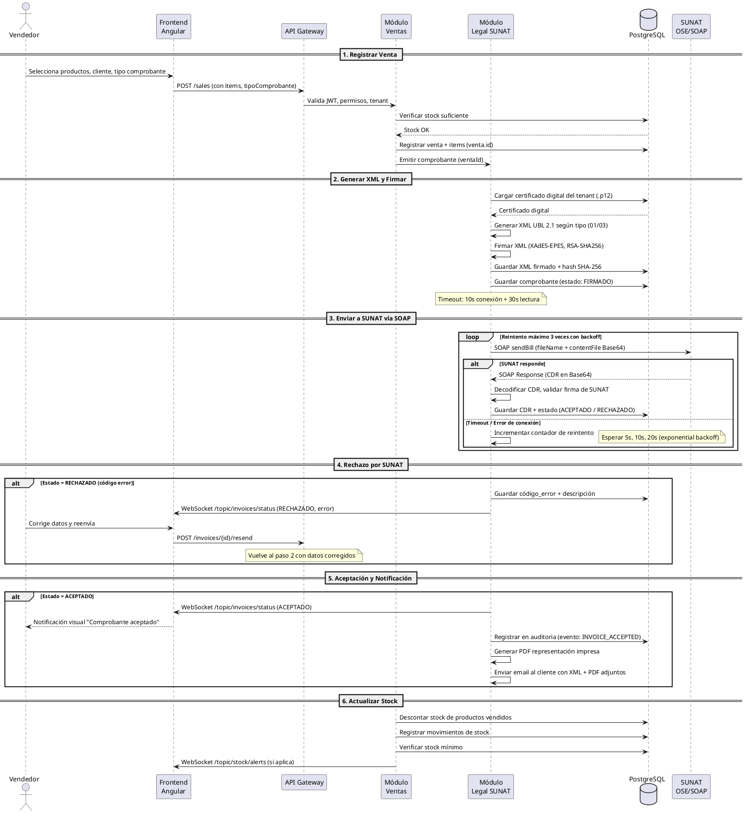
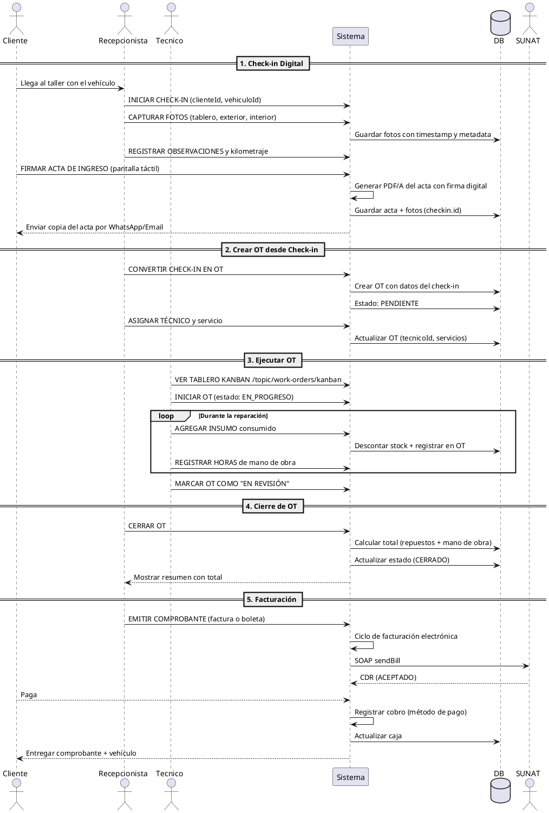
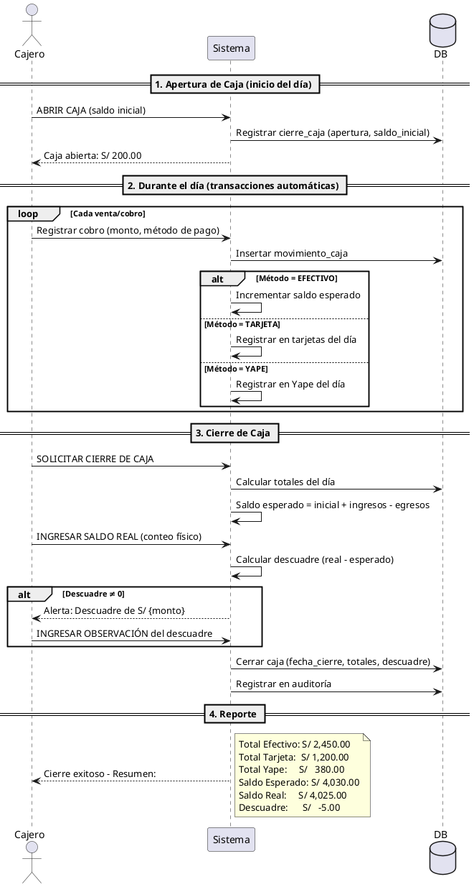
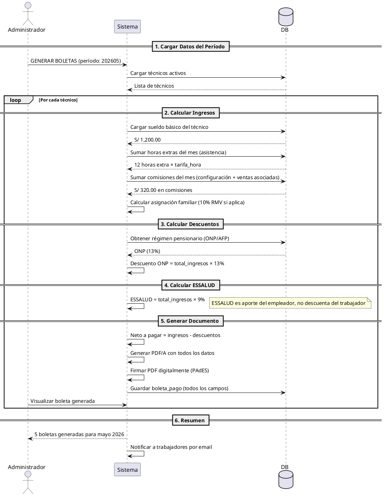
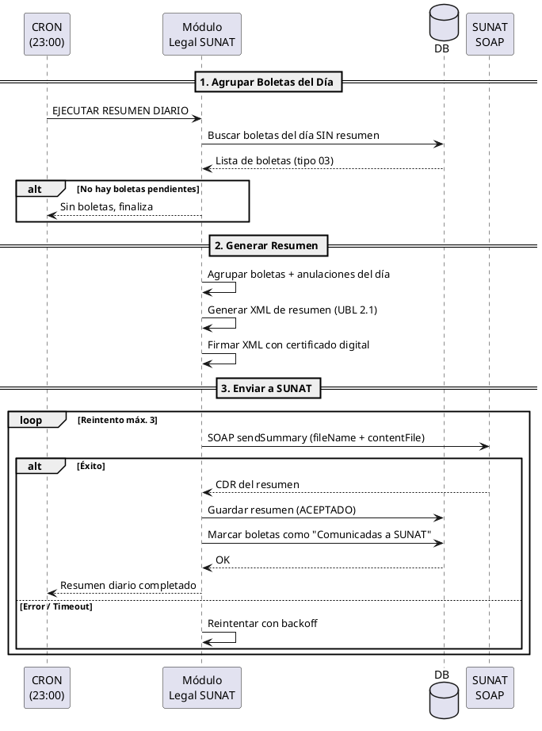
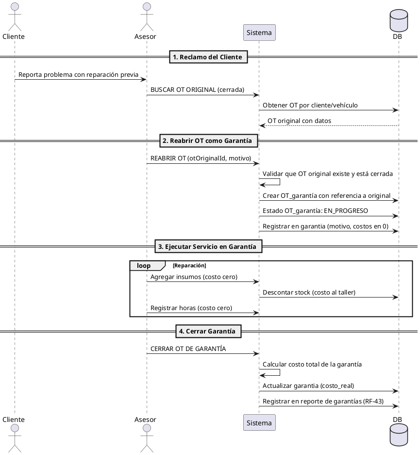
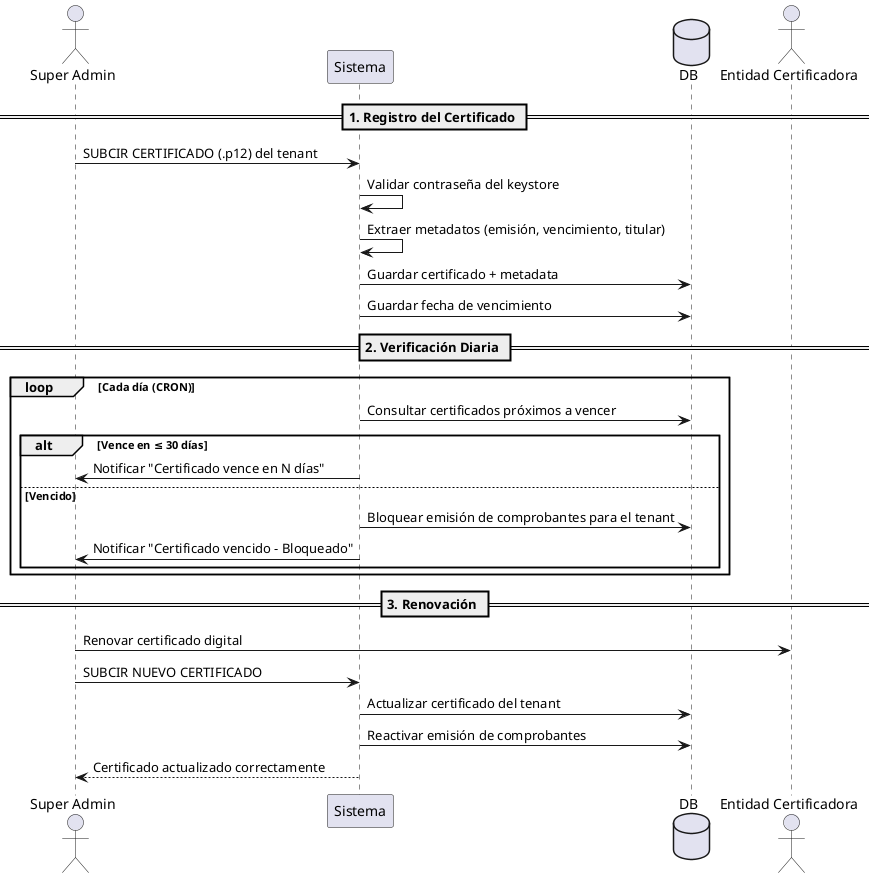

# Diagramas de Secuencia — LUNORION LABS

Flujos críticos del sistema con énfasis en procesos legales (facturación SUNAT vía SOAP, RRHH, garantías).

Los diagramas están escritos en PlantUML. Renderizar en https://www.plantuml.com/plantuml/uml/ o IDE con plugin.

---

## 1. Facturación Electrónica — Ciclo Completo (SOAP)

Flujo crítico legal: desde que el vendedor registra la venta hasta que SUNAT acepta el comprobante y se notifica al cliente.

---

## 2. Check-in → OT → Cierre → Facturación

Flujo completo del servicio: desde que el cliente llega al taller hasta que paga.

---

## 3. Cierre de Caja Diario

---

## 4. Generación de Boleta de Pago Electrónica (RRHH)

---

## 5. Resumen Diario de Boletas (RDB)

Ejecutado automáticamente por CRON al final del día. Las boletas (tipo 03) se agrupan y envían a SUNAT.

---

## 6. Flujo de Garantía (Reapertura de OT)

---

## 7. Ciclo de Vida del Certificado Digital

---

## Leyenda de Colores para Diagramas

| Color | Significado |
|:---|:---|
| **Actor** | Persona o sistema externo que inicia la interacción |
| **Participant** | Módulo interno del sistema |
| **Database** | PostgreSQL |
| **Línea continua** | Llamada síncrona (REST, consulta DB, método) |
| **Línea punteada** | Respuesta, callback o WebSocket |
| **Loop** | Repetición (reintentos, iteraciones) |
| **Alt** | Condicional (if/else) |
| **Note** | Comentario o detalle adicional |
